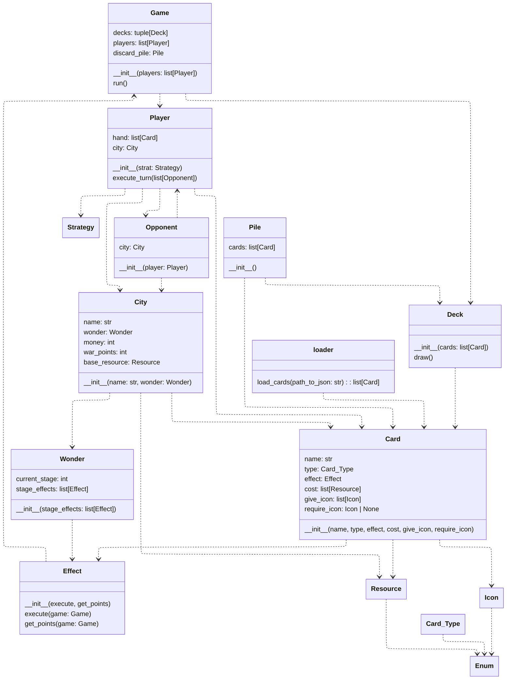

# 7 simulator

Simple hobby project [7 wonders board game](https://en.wikipedia.org/wiki/7_Wonders_(board_game)) simulation and statistics.

## Tech stack

obviously python, uv, nix

## Resources

Card info taken from : https://7-wonders.fandom.com/wiki/List_of_Cards#Overview

## Design

`src/engine` contains the main engine code.

`src/load` contains code to load the game from jsons

## iterative steps

- statistics:
  - median card cost (era/total)
  - card type per era/total
  - balamced game card value estimate per number of players
- dumb game simulation
- strategy comparison

## Statistics questions

statistic questions are answered in `src/stats`

### Card availability

How many cards per type are available every game per number of players?

### Resource availability

How much resources are available every game per given number of players?

### Resource Value per card type

given values to each resource type (1 for basic, 3 for rare), what is the resource points mean for each mil and pure victory point?
