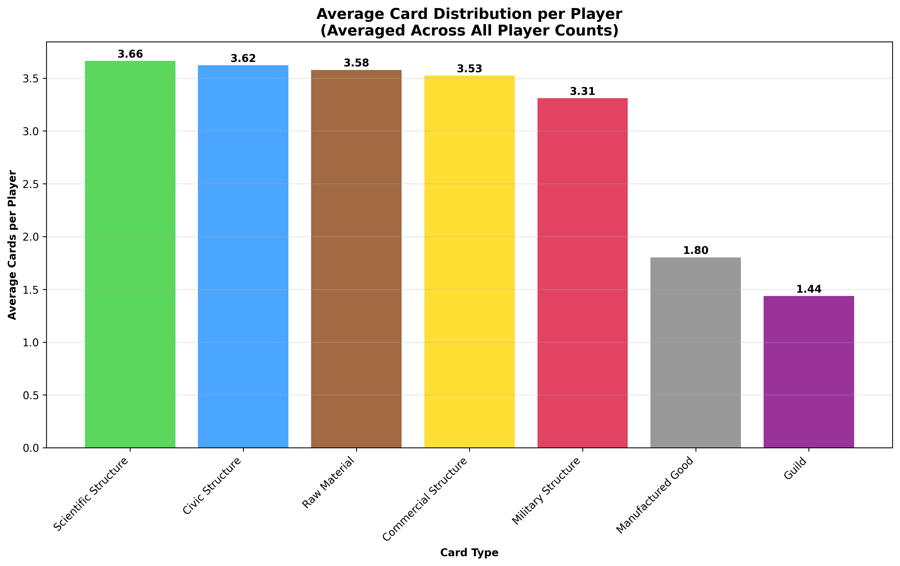
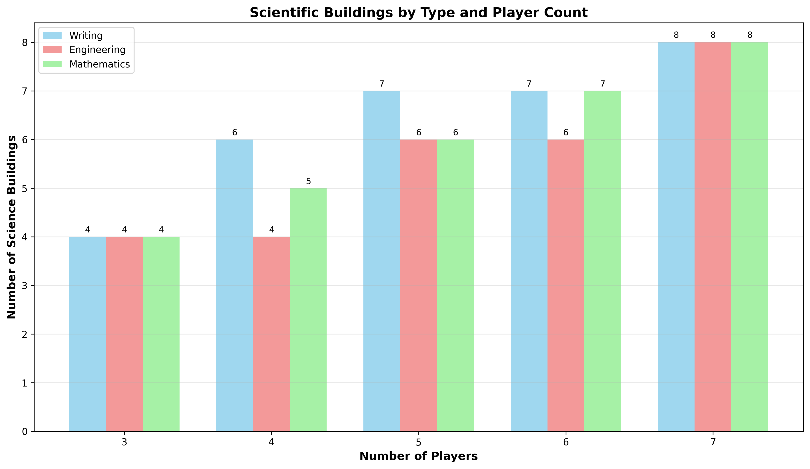

# Results

Here are reported the results of the statistical analisys, which will be summarised in the slideshow (TODO)

All results where obtained from files in `src/stats`

Note: Remember to generate the graphs running:

```sh
just stats
```

## Resource availablility

It would be interesting to see how many resources of each type (base, rare and why not even money) is available through cards for every player per game per number of players in the game.

This was explored in `res_avail.py`

The following graphs summarise the results:


### Resource Availability Summary

3 players:

- Total Base Resources: 14
- Total Rare Resources: 6
- Base/Player: 4.67
- Rare/Player: 2.00
- Base:Rare Ratio: 2.33:1

4 players:

- Total Base Resources: 21
- Total Rare Resources: 6
- Base/Player: 5.25
- Rare/Player: 1.50
- Base:Rare Ratio: 3.50:1

5 players:

- Total Base Resources: 28
- Total Rare Resources: 9
- Base/Player: 5.60
- Rare/Player: 1.80
- Base:Rare Ratio: 3.11:1

6 players:

- Total Base Resources: 30
- Total Rare Resources: 12
- Base/Player: 5.00
- Rare/Player: 2.00
- Base:Rare Ratio: 2.50:1

7 players:

- Total Base Resources: 30
- Total Rare Resources: 12
- Base/Player: 4.29
- Rare/Player: 1.71
- Base:Rare Ratio: 2.50:1


This means that the avarage ratio of base resources to rare resources in a game is:

(2.33 + 3.50 + 3.11 + 2.50 + 2.50) / 5 = 13.94 / 5 = 2.79

This provides a proof to justify the Resource Point system discussed later.

## Resource balance

Are all resources equally available per game per number of players?

This was explored in `res_balance.py`

The results are summarized in the following graphs:


### Resource Distribution Summary

3 players:
- Base Resources:
  - WOOD: 4 (25.0%)
  - ORE: 4 (25.0%)
  - BRICK: 4 (25.0%)
  - STONE: 4 (25.0%)
- Rare Resources:
  - GLASS: 2 (33.3%)
  - PAPYRUS: 2 (33.3%)
  - TEXTILES: 2 (33.3%)
- Totals: Base=16, Rare=6
- Per Player: Base=5.33, Rare=2.00
- Base:Rare Ratio: 2.67:1

4 players:
- Base Resources:
  - WOOD: 7 (29.2%)
  - ORE: 7 (29.2%)
  - BRICK: 5 (20.8%)
  - STONE: 5 (20.8%)
- Rare Resources:
  - GLASS: 2 (33.3%)
  - PAPYRUS: 2 (33.3%)
  - TEXTILES: 2 (33.3%)
- Totals: Base=24, Rare=6
- Per Player: Base=6.00, Rare=1.50
- Base:Rare Ratio: 4.00:1

5 players:
- Base Resources:
  - WOOD: 8 (25.0%)
  - ORE: 8 (25.0%)
  - BRICK: 8 (25.0%)
  - STONE: 8 (25.0%)
- Rare Resources:
  - GLASS: 3 (33.3%)
  - PAPYRUS: 3 (33.3%)
  - TEXTILES: 3 (33.3%)
- Totals: Base=32, Rare=9
- Per Player: Base=6.40, Rare=1.80
- Base:Rare Ratio: 3.56:1

6 players:
- Base Resources:
  - WOOD: 9 (25.0%)
  - ORE: 9 (25.0%)
  - BRICK: 9 (25.0%)
  - STONE: 9 (25.0%)
- Rare Resources:
  - GLASS: 4 (33.3%)
  - PAPYRUS: 4 (33.3%)
  - TEXTILES: 4 (33.3%)
- Totals: Base=36, Rare=12
- Per Player: Base=6.00, Rare=2.00
- Base:Rare Ratio: 3.00:1

7 players:
- Base Resources:
  - WOOD: 9 (25.0%)
  - ORE: 9 (25.0%)
  - BRICK: 9 (25.0%)
  - STONE: 9 (25.0%)
- Rare Resources:
  - GLASS: 4 (33.3%)
  - PAPYRUS: 4 (33.3%)
  - TEXTILES: 4 (33.3%)
- Totals: Base=36, Rare=12
- Per Player: Base=5.14, Rare=1.71
- Base:Rare Ratio: 3.00:1

## Card type distribution

What is an average city card type distribution?

This was explored in `card_balance.py`




This shows that an average distribution across all games for every card type is for every city/player to have 3/4 of every card type, with the exception of manufactured goods and guild cards, which would be present 1/2 per city/player.

### Card Type Distribution Summary

3 players:
  Total cards: 63
  Cards per player: 21.00
  Card Type Breakdown:
    Raw Material: 10 (15.9%)
    Manufactured Good: 6 (9.5%)
    Civic Structure: 12 (19.0%)
    Commercial Structure: 9 (14.3%)
    Military Structure: 9 (14.3%)
    Scientific Structure: 12 (19.0%)
    Guild: 5 (7.9%)

4 players:
  Total cards: 82
  Cards per player: 20.50
  Card Type Breakdown:
    Raw Material: 15 (18.3%)
    Manufactured Good: 6 (7.3%)
    Civic Structure: 14 (17.1%)
    Commercial Structure: 13 (15.9%)
    Military Structure: 13 (15.9%)
    Scientific Structure: 15 (18.3%)
    Guild: 6 (7.3%)

5 players:
  Total cards: 106
  Cards per player: 21.20
  Card Type Breakdown:
    Raw Material: 20 (18.9%)
    Manufactured Good: 9 (8.5%)
    Civic Structure: 17 (16.0%)
    Commercial Structure: 17 (16.0%)
    Military Structure: 17 (16.0%)
    Scientific Structure: 19 (17.9%)
    Guild: 7 (6.6%)

6 players:
  Total cards: 126
  Cards per player: 21.00
  Card Type Breakdown:
    Raw Material: 22 (17.5%)
    Manufactured Good: 12 (9.5%)
    Civic Structure: 21 (16.7%)
    Commercial Structure: 23 (18.3%)
    Military Structure: 20 (15.9%)
    Scientific Structure: 20 (15.9%)
    Guild: 8 (6.3%)

7 players:
  Total cards: 147
  Cards per player: 21.00
  Card Type Breakdown:
    Raw Material: 22 (15.0%)
    Manufactured Good: 12 (8.2%)
    Civic Structure: 26 (17.7%)
    Commercial Structure: 29 (19.7%)
    Military Structure: 25 (17.0%)
    Scientific Structure: 24 (16.3%)
    Guild: 9 (6.1%)

#### Average Card Distribution per Player (Across All Player Counts)
  Scientific Structure: 3.66 cards per player
  Civic Structure: 3.62 cards per player
  Raw Material: 3.58 cards per player
  Commercial Structure: 3.53 cards per player
  Military Structure: 3.31 cards per player
  Manufactured Good: 1.80 cards per player
  Guild: 1.44 cards per player
  Total average cards per player (sum over types): 20.94

## Card cost

A good baseline start would be to find the avarage cost of a card per era per number of players

This would be interesting to know as in a given game knowing the avarage cost of a card would enable the player to evaluate if his city currently produces enough resources by itself, or through trading with neighbors, to build most of the era cards.

Since not all resources are equal, a 'resource point' (RP) system must be used to enable the comparison between different card costs.

A good RP system would be to assign:

- 1 RP per base resource needed
- 1 RP per money needed
- 3 RP per rare resource needed

The value ration between base resource and rare resource is justified by the avarage resource availability ratio between base and rare resource is 2.79, as proven in the [Resource availablility](#resource-availability) chapter.

The value given for money is totally instinctive. An evaluation could be made based on the money obtained through cards and wonders, but this is not enough for a true justification, as trade between neighboring cities is hard to take account for without actual game data.

This was explored in `card_cost.py`


### Card Cost Analysis Summary

3 players:

- Era 1 average cost: 0.71 RP
- Era 2 average cost: 2.48 RP
- Era 3 average cost: 6.50 RP
- Overall average cost: 3.47 RP
- Total cards: 68

4 players:

- Era 1 average cost: 0.71 RP
- Era 2 average cost: 2.38 RP
- Era 3 average cost: 6.25 RP
- Overall average cost: 3.28 RP
- Total cards: 86

5 players:

- Era 1 average cost: 0.71 RP
- Era 2 average cost: 2.33 RP
- Era 3 average cost: 5.95 RP
- Overall average cost: 3.07 RP
- Total cards: 109

6 players:

- Era 1 average cost: 0.64 RP
- Era 2 average cost: 2.36 RP
- Era 3 average cost: 6.02 RP
- Overall average cost: 3.05 RP
- Total cards: 128

7 players:

- Era 1 average cost: 0.65 RP
- Era 2 average cost: 2.39 RP
- Era 3 average cost: 6.08 RP
- Overall average cost: 3.06 RP
- Total cards: 148

### Era Averages (Across All Player Counts)

- Era 1: 0.69 RP
- Era 2: 2.39 RP
- Era 3: 6.16 RP
- Era 1 → Era 2: +247.2% increase
- Era 2 → Era 3: +158.0% increase

These results prove that the game is pretty well built as most value distributions have very low variance, too low to be accidental.

## Card Type Point Cost

All the statistics gathered till now will enable us to evaluate the Point production per Resource Point for every card type

For free cards we can add 1 to the calculated gained victory points.

This was explored in `card_value.py`

### Blue cards

These are the easiest since they always give a fixed amount of victory points.

- Altar: 4
- Theater: 4
- Well: 4
- Baths: 3.0
- Courthouse: 0.8
- Temple: 0.8
- Statue: 1.3333333333333333
- Acqueduct: 1.6666666666666667
- Gardens: 1.6666666666666667
- Senate: 1.5
- Town Hall: 1.0
- Pantheon: 0.5833333333333334
- Palace: 0.6153846153846154

average card value: 1.9204142011834322
average card value removing first era cards: 1.1072649572649573

The best cards:

- era 1:
    - Altar, Theater, Well
- era 2:
    - Acqueduct
- era 3:
    - Gardens, (Senate close second)

### Yellow cards

Since we know the average number of cards per type in a match we can aproximate the points provided by yellow cards using those values:
Since 3 coins provide 1 Victory point at game end, we can use add them to the total victory points generated.

$$
PureVP = TypeAverage+CitiesConsidered+VictoryPoints
CoinVP = (TypeAverage+CitiesConsidered+Coins) / 3
$$

Arena can be manually calculated by considering that by the third era all wonder stages will have been built

$$
PureVP = VictoryPoints * 3
CoinVP = (Coins * 3) / 3
$$

- Arena: 2.0
- Tavern: 2.666666666666667
- Vineyard: 4.58
- Bazaar: 4.6
- Lighthouse: 1.1766666666666665
- Haven: 0.9546666666666667
- Chamber of Commerce: 0.96
- Ludus: 3.31

average card value: 2.5309999999999997

### Red Cards

Red cards VPs depend on the era they belong to, as a battle win in the first era is worth much less as a battle win in the third era.

For every era

$$
VP = (PuntiPerFM * FM) / CostoInRP
$$

Con:

$$
PuntiPerFM = (PuntiVM/MediaFMEra) + 1
$$

Military Points per era per player:

- For 3 players
    - For 0 era: 1.0
    - For 1 era: 2.0
    - For 2 era: 3.0
- For 4 players
    - For 0 era: 1.0
    - For 1 era: 2.0
    - For 2 era: 3.75
- For 5 players
    - For 0 era: 1.0
    - For 1 era: 2.0
    - For 2 era: 4.2
- For 6 players
    - For 0 era: 0.8333333333333334
    - For 1 era: 2.3333333333333335
    - For 2 era: 4.0
- For 7 players
    - For 0 era: 0.8571428571428571
    - For 1 era: 2.5714285714285716
    - For 2 era: 4.285714285714286

Average Military Points per era per player:

- For 1 era: 1 (from: 0.9380952380952381)
- For 2 era: 2 (from: 2.180952380952381)
- For 3 era: 4 (from: 3.847142857142857)

Value Points per card:

- For 1 era:
    - Guard Tower: 1.031941031941032
    - Baracks: 1.031941031941032
    - Stockade: 1.031941031941032
- For 2 era:
    - Stables: 1.2574850299401197
    - Archery Range: 1.2574850299401197
    - Walls: 1.2574850299401197
    - Training Ground: 1.2574850299401197
- For 3 era:
    - Arsenal: 1.031535514294135
    - Siege Workshop: 1.5473032714412023
    - Fortifications: 1.5473032714412023
    - Circus: 1.5473032714412023
    - Castrum: 1.031535514294135

- Guard Tower: 1.031941031941032
- Baracks: 1.031941031941032
- Stockade: 1.031941031941032
- Stables: 1.2574850299401197
- Archery Range: 1.2574850299401197
- Walls: 1.2574850299401197
- Training Ground: 1.2574850299401197
- Arsenal: 1.031535514294135
- Siege Workshop: 1.5473032714412023
- Fortifications: 1.5473032714412023
- Circus: 1.5473032714412023
- Castrum: 1.031535514294135

average card value: 1.235895338207954

### Purple Cards

Here we use a similar method as with commercial cards:

- Workers Guild: 1.432
- Craftsmens Guild: 2.4
- Magistrates Guild: 1.0342857142857143
- Traders Guild: 0.7844444444444444
- Spies Guild: 1.324
- Philosophers Guild: 0.8133333333333334
- Shipowners Guild: 0.7577777777777778

These two can be manually calculated by considering that by the third era all wonder stages will have been built

- Decorators Guild: 1.1666666666666667
- Builders Guild: 1.125

average card value: 1.2041675485008816

### Green cards

#### Science Building Availability

Not all tecnologies are made the same:

Tech building balance per number of players is shown in the following graph:



- 3 players:
  - Writing: 4
  - Engineering: 4
  - Mathematics: 4
- 4 players:
  - Writing: 6
  - Engineering: 4
  - Mathematics: 5
- 5 players:
  - Writing: 7
  - Engineering: 6
  - Mathematics: 6
- 6 players:
  - Writing: 7
  - Engineering: 6
  - Mathematics: 7
- 7 players:
  - Writing: 8
  - Engineering: 8
  - Mathematics: 8

This shows that when possible the writing buildings are usually more present, so they should be preferred

#### Science cards value

Now there are two ways of making points with scientific cards.

- 7 points for each triplet of different scientific subjects
- exponential points for same kind scientific buildings

Clearly going for the exponential points, if possible is ideal, since with 3 buildings:

- different subjects: 7 points
- same subject: 9 points

Since it has been determined that the mean scientific building number per city is 3/4 buildings, the ideal situation is to have 4 buildings for a single scientific subject, providing 16 points in total

A card value can be approximated for every subject by averaging the cost of cards that provide that subject and multipling it by 4, which is the points generated by every card in the ideal '4 same subject' case.

This way we can approximate the best subject to go for:

- Writing: 0.8
- Engineering: 0.6956521739130435
- Mathematics: 0.7272727272727273

average card value: 0.7409749670619236

## Final averages

Final Averages:

- Blue: 1.9204142011834322
- Yellow: 2.5309999999999997
- Red: 1.235895338207954
- Purple: 1.2041675485008816
- Green: 0.7409749670619236

Best cards per era:

- For 1 era
    - Altar: 4
    - Theater: 4
    - Well: 4
    - Baths: 3.0
    - Tavern: 2.666666666666667
    - Guard Tower: 1.031941031941032
    - Baracks: 1.031941031941032
    - Stockade: 1.031941031941032
- For 2 era
    - Bazaar: 4.6
    - Vineyard: 4.58
    - Acqueduct: 1.6666666666666667
    - Statue: 1.3333333333333333
    - Stables: 1.2574850299401197
    - Archery Range: 1.2574850299401197
    - Walls: 1.2574850299401197
    - Training Ground: 1.2574850299401197
    - Courthouse: 0.8
    - Temple: 0.8
- For 3 era
    - Ludus: 3.31
    - Arena: 2.0
    - Gardens: 1.6666666666666667
    - Siege Workshop: 1.5473032714412023
    - Fortifications: 1.5473032714412023
    - Circus: 1.5473032714412023
    - Senate: 1.5
    - Lighthouse: 1.1766666666666665
    - Arsenal: 1.031535514294135
    - Castrum: 1.031535514294135
    - Town Hall: 1.0
    - Chamber of Commerce: 0.96
    - Haven: 0.9546666666666667
    - Palace: 0.6153846153846154
    - Pantheon: 0.5833333333333334

