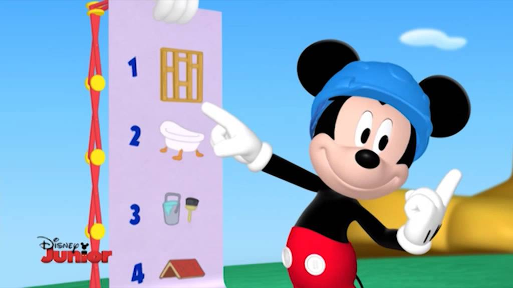
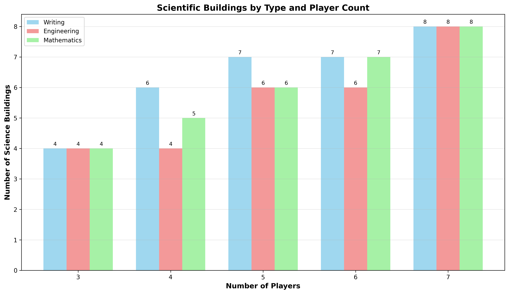

<!-- _class: lead invert -->

# Come cazzo si vince a Seven Wonders?
### (...senza usare internet)

Leonardo Randacio

---

## Come cazzo si vince a Seven Wonders?

Boh

Cercare su internet sarebbe barare

---

## Cosa fare?

Opzioni:

- Usare carta e penna (circa 1 ora)
- Farlo fare al computer (circa troppe ore)

---

<!-- _class: lead -->

### Ovviamente ho scelto la seconda

---

<!-- _class: lead invert -->

# Recap Regole Seven Wonders

---

### Recap Regole Seven Wonders

---

### Recap Regole Seven Wonders

- 'Pronti? 1..2..3'
- 'ASPETTA UN ATTIMO!'
- 'In che verso si passano le carte?'
- 'Chi mi fa da calcolatrice?'

---

Come procediamo?

- Raccogliamo strumentopoli!
- Formule matematiche!!!
- Conclusioni!!!!!!

---

---

<!-- _class: lead invert -->

# Disponibilità delle risorse

---

### Disponibilità delle risorse

- Materie Prime (carte marroni)
    - Argilla
    - Pietra
    - Minerale
    - Legno
- Manufatti (carte grigie)
    - Vetro
    - Tessuto
    - Papiro

---

### Disponibilità delle risorse

- Risorse 'Base' (carte marroni)
    - Argilla
    - Pietra
    - Minerale
    - Legno
- Risorse 'Rare' (carte grigie)
    - Vetro
    - Tessuto
    - Papiro

---

### Disponibilità delle risorse

Qual'è il livello di disponiblità di ogni risorsa?

In altre parole...

Qualè la differenza di valore tra le risorse base e le risorse rare?

---

### Disponibilità delle risorse

---

### Disponibilità delle risorse

---

### Disponibilità delle risorse

Questo significa che il rapporto tra le risorse base e rare medio è

$$
(2.33 + 3.50 + 3.11 + 2.50 + 2.50) / 5 = 
$$

$$
13.94 / 5 =
$$

$$
2.79
$$

Quindi una risorsa rara vale come ~ 3 risorse base

Questo risulato ci sarà utile in seguito (ಠ ‿↼)

---

<!-- _class: lead invert -->

# Distribuzione delle risorse

---

### Distribuzione delle risorse

Le risorse base sono tutte uguali?

E le rare?

---

### Distribuzione delle risorse

---

### Distribuzione delle risorse

---

### Distribuzione delle risorse

In parite da 4 giocatori argilla e pietra hanno più valore

Nelle altre parite tutte le risorse sono uguali

---

### Distribuzione delle risorse

Potevo immaginarlo?

Si

Dovevo esserne sicuro?

Anche

---

<!-- _class: lead invert -->

# Distribuzione delle carte

---

### Distribuzione delle carte

Quante carte sono disponibli per ogni tipo?

Com'è fatta la città media?

---

### Distribuzione delle carte

---

### Distribuzione delle carte

---

### Distribuzione delle carte

La città/giocatore media/o avrà:

- 1/2 carte gilda
- 1/2 carte manufatti
- 3/4 carte per ogni altro tipo

Questo risulato ci sarà utile in seguito (***wink wink***)

---

<!-- _class: lead invert -->

# Costo delle Carte

---

### Costo delle Carte

Quanto costa in media una carta per ogni era?

Come possiamo paragonare i costi delle carte?

---

### Costo delle Carte

Le carte possono costare:

- Risorse
- Monete

---

### Costo delle Carte

Le carte possono costare:

- Risorse base
- Risorse rare
- Monete

---

### Costo delle Carte

Usiamo Resource Point

- Risorse base = 1 RP
- Risorse rare = 3 RP
- Monete = 1 RP (o 2 RP, cambia poco)

---

### Costo delle Carte

---

### Costo delle Carte

Costo medio:

- Era 1: 0.69 RP
- Era 2: 2.39 RP
- Era 3: 6.16 RP

Questo indipendentemente dal numero di giocatori!

- più giocatori = costo medio minore
- delta principalmente terza era
- bassa varianza

---

### Costo delle Carte

Ora possiamo determinare per ogni carta il suo 'valore':

Usando Value Points:

$$
VP = Punti Guadagnati / Costo In RP
$$

Se costo in RP = 0

$$
VP = Punti Guadagnati + 1
$$

Ultimo strumentopolo acquisito ☝( ◠‿◠ )

---

<!-- _class: lead invert -->

# Carte Blu

---

### Carte Blu

  

$$
VP = NumeroSullaCarta / Costo In RP
$$

---

### Carte Blu

- prima era:
    - Altare, Teatro, Pozzo: 4 (duh)
- seconda era:
    - Acquedotto: 1.6
- terza era:
    - Giardini: 1.6, (Senato: 1.5)

Valore Medio: 1.92
Valore Medio (senza prima era): 1.11

---

<!-- _class: lead invert -->

# Carte Gialle

---

### Carte Gialle

$$
VP = VPPuri+VPMonete / CostoInRP
$$

Con:

$$
VPPuri = MediaTipo*CittàConsiderate*PuntiGuadagnati
$$
$$
VPMonete = (MediaTipo*CittàConsiderate*MoneteGuadagnate) / 3
$$

Arena può essere calcolato considerando che in genere si costriuiscono tutti gli stadi

$$
VPPuri = PuntiGuadagnati * 3
$$
$$
VPMonete = (MoneteGuadagnate * 3) / 3
$$

---

### Carte Gialle

- prima era:
    - Taverna: 2.7 (duh)
- seconda era:
    - Bazar, Vigneto: 4.6 (circa)
- terza era:
    - Palestra Gladiatoria: 3.3

Valore medio: 2.53

---

<!-- _class: lead invert -->

# Carte viola

---

### Carte Viola

Ragionamento analogo per carte viola...

$$
VP = VPPuri / CostoInRP
$$

Con:

$$
VPPuri = MediaTipo*CittàConsiderate*PuntiGuadagnati
$$

Per carte che contano meraviglie consideriamo 3 stadi completi

---

### Carte Viola

Top 3:

- Gilda degli Artigiani: 2.4 (!)
- Gilda dei Lavoratori: 1.4
- Gilda delle Spie: 1.3

Valore medio: 1.20

---

<!-- _class: lead invert -->

# Carte Rosse

---

### Carte Rosse

Per ogni era:

$$
VP = (PuntiPerFM * FM) / CostoInRP
$$

Con:

$$
PuntiPerFM = PuntiVM / (MediaFMEra + 1)
$$

$$
PuntiVM = [1,3,5] * 2
$$

---

### Carte Rosse

Punti medi Forza Militare per giocatore:

- prima era: 1
- seconda era: 2 (+ 1 = 3)
- terza era: 4 (+ 3 = 7)

Carte Migliori:

- prima era: Tutte! (1.0)
- seconda era: Tutte! (1.3)
- terza era: Opificio D'Assedio, Fortificazioni, Circo (1.5)

**Hanno valori simili!**

---

<!-- _class: lead invert -->

# Carte Verdi

---

### Carte Verdi

Non tutte le scienze sono uguali!

---

### Carte Verdi

  

- 3 stesso tipo = 9 Punti
- 3 diverso tipo = 7 Punti

Meglio se stesso tipo!

---

### Carte Verdi

Dato che in media ogni città ha 3/4 carte verdi, per ogni tipo:

  

$$
VP = 4 / MediaCostoInRP
$$

---

### Carte Verdi

- Scrittura: 0.8
- Matematica: 0.7
- Ingegneria: 0.7 :(

Valore Medio: 0.74

La scienza non ripaga

---

<!-- _class: lead invert -->

# Meraviglie

---

### Meraviglie

---

<!-- _class: lead invert -->

# Conclusioni

---

### Conclusioni

- Risorse (senza contare città):
    - 3/4 risorse base
    - 1/2 risorse rare
- Forza militare:
    - Prima era: 1/2
    - Seconda era: 3/4
    - Terza era: 7/8
- 3/4 per ogni altra tipologia (1/2 di gilde)
- solo un tipo di scienza (idealmente Scrittura)

---

### Conclusioni

Media VP:

- Commerciali (Gialle): 2.53
- Civili (Blu): 1.92
- Militari (Rosse): 1.24
- Gilde (Viola): 1.20
- Scintifiche (Verdi): 0.74

---

### Conclusioni

Carte Migliori:

- Prima era:
    - 🟦 Altare, Teatro, (4+) Pozzo: 4.0
    - 🟦 Bagni: 3.0
    - (4+) 🟨 Taverna: 2.7

- Seconda era:
    - 🟨 Vigneto, (4+) Bazar: 4.6
    - 🟦 Acquedotto: 1.7
    - 🟦 Statua: 1.3

---

### Conclusioni

Carte Migliori:

- Terza era:
    - (4+) 🟨 Palestra Gladiatoria: 3.3
    - 🟨 Arena: 2.0
    - 🟦 Giardini: 1.7

---

### Conclusioni

Come consideriamo...:

- mercati
- concatenazioni
- città (meraviglia, risorsa)
- occhi

---

<!-- _class: lead invert -->

# Fine...

---

<!-- _class: lead invert -->

# Fine?

---

<!-- _class: lead invert -->

# Fine

### (Per adesso...)

