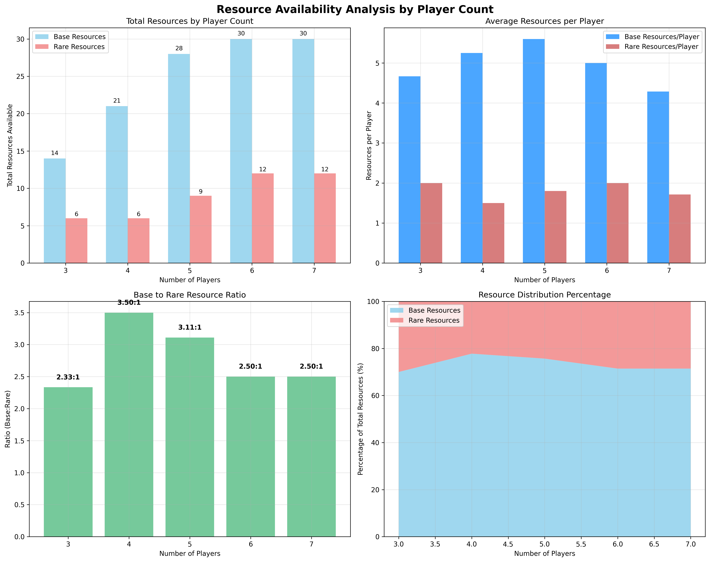

<!-- _class: lead invert -->

# Come cazzo si vince a Seven Wonders?
### (...senza usare internet)

Leonardo Randacio

---

## Come cazzo si vince a Seven Wonders?

Boh

Cercare su internet sarebbe barare

---

## Cosa fare?

2 Opzioni:

- Usare carta e penna (circa 1 ora)
- Farlo fare al computer (circa 8 ore)

---

<!-- _class: lead -->

### Ovviamente ho scelto la seconda

---

<!-- _class: lead invert -->

# Recap Regole Seven Wonders

---

### Recap Regole Seven Wonders

---

### Recap Regole Seven Wonders

- 'Pronti? 1..2..3'
- 'ASPETTA UN ATTIMO!'
- 'In che verso si passano le carte?'
- 'Chi mi fa da calcolatrice?'

---

<!-- _class: lead invert -->

# Disponibilità delle risorse

---

### Disponibilità delle risorse

- Materie Prime (carte marroni)
    - Argilla
    - Pietra
    - Minerale
    - Legno
- Manufatti (carte grigie)
    - Vetro
    - Tessuto
    - Papiro

---

### Disponibilità delle risorse

- Risorse 'Base' (carte marroni)
    - Argilla
    - Pietra
    - Minerale
    - Legno
- Risorse 'Rare' (carte grigie)
    - Vetro
    - Tessuto
    - Papiro

---

### Disponibilità delle risorse

Qual'è il livello di disponiblità di ogni risorsa?

In altre parole...

Qualè la differenza di valore tra le risorse base e le risorse rare?

---

### Disponibilità delle risorse

---

### Disponibilità delle risorse

---

### Disponibilità delle risorse

Questo significa che il rapporto tra le risorse base e rare medio è

$$
(2.33 + 3.50 + 3.11 + 2.50 + 2.50) / 5 = 
$$

$$
13.94 / 5 =
$$

$$
2.79
$$

Quindi una risorsa rara vale come ~ 3 risorse base

Questo risulato ci sarà utile in seguito :)

---

<!-- _class: lead invert -->

# Distribuzione delle risorse

---

### Distribuzione delle risorse

Le risorse base sono tutte uguali?

E le rare?

---

### Distribuzione delle risorse

---

### Distribuzione delle risorse

---

### Distribuzione delle risorse

In parite da 4 giocatori argilla e pietra hanno più valore.

Nelle altre parite tutte le risorse sono uguali

---

### Distribuzione delle risorse

Potevo immaginarlo?

Si

Dovevo esserne sicuro?

Anche

---

<!-- _class: lead invert -->

# Distribuzione delle carte

---

### Distribuzione delle carte

Quante carte sono disponibli per ogni tipo?

Com'è fatta la città media?

---

### Distribuzione delle carte

---

### Distribuzione delle carte

---

### Distribuzione delle carte

La città/giocatore media avrà:

- 1/2 carte gilda
- 1/2 carte manufatti
- 3/4 carte per ogni altro tipo

---

<!-- _class: lead invert -->

# Costo delle Carte

---

### Costo delle Carte

Quanto costa in media una carta per ogni era?

Come possiamo paragonare i costi delle carte?

---

### Costo delle Carte

Le carte possono costare:

- Risorse
- Monete

---

### Costo delle Carte

Le carte possono costare:

- Risorse base
- Risorse rare
- Monete

---

### Costo delle Carte

Usiamo Resource Point

- Risorse base = 1 RP
- Risorse rare = 3 RP
- Monete = RP

---

### Costo delle Carte

---

### Costo delle Carte

Costo medio:

- Era 1: 0.69 RP
- Era 2: 2.39 RP
- Era 3: 6.16 RP

Questo indipendentemente dal numero di giocatori!

---

### Costo delle Carte

Ora possiamo determinare per ogni carta il suo rapporto punti/costo!

Usando Value Points:

$$
VP = Punti Guadagnati / Costo RP
$$

Se costo in RP = 0

$$
VP = Punti Guadagnati + 1
$$

---

<!-- _class: lead invert -->

# Carte blu

---

### Carte blu

$$
VP = NumeroSullaCarta / Costo RP
$$

---

### Carte blu

- prima era:
    - Altare, Teatro, Pozzo: 4 (duh)
- seconda era:
    - Acquedotto: 1.6
- terza era:
    - Giardini: 1.6, (Senato: 1.5)

Valore Medio: 1.92
Valore Medio (senza prima era): 1.11

---

<!-- _class: lead invert -->

# Carte gialle

---

### Carte gialle

$$
VP = VPPuri+VPMonete
$$

Con:

$$
VPPuri = MediaTipo+CittàConsiderate+PuntiGuadagnati
$$
$$
VPMonete = (MediaTipo+CittàConsiderate+MoneteGuadagnate) / 3
$$

Arena può essere calcolato considerando che in genere si costriuiscono tutti gli stadi

$$
VPPuri = PuntiGuadagnati * 3
$$
$$
VPMonete = (MoneteGuadagnate * 3) / 3
$$

---

### Carte gialle

- prima era:
    - Taverna: 2.7 (duh)
- seconda era:
    - Bazar, Vinyard: 2.2
- terza era:
    - Arena: 6, (Ludus: 1.6)

Valore medio: 1.94
Valore medio (senza Arena): 1.35

---

<!-- _class: lead invert -->

# Meraviglie

---

### Meraviglie

---

<!-- _class: lead invert -->

# The end

### (For now...)
